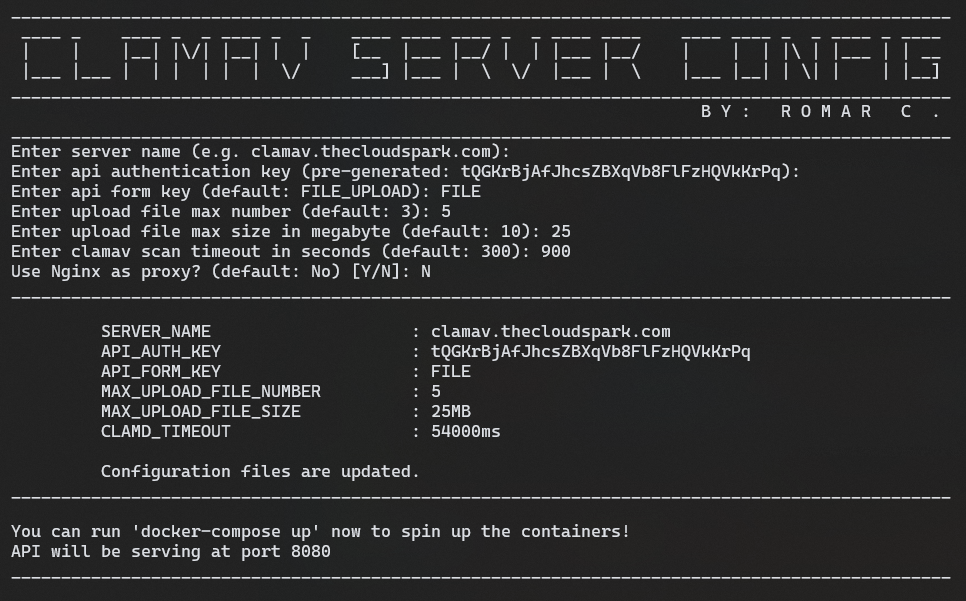

# ClamAV Container Setup

[](https://github.com/romarcablao)
[](https://linkedin.com/in/romarcablao)

Setup your own ClamAV instance using docker and docker-compose.

### I. Folder Structure

1. `clamav-api` - contains config for clamav api container
2. `clamav` - contains config for clamav container
3. `nginx` - contains config and certs for nginx proxy container
4. `templates` - contains docker-compose and nginx conf template
   1. `cloudformation` - contains template for ec2 instance and route 53
   2. `*.yaml and *.conf` - yaml and conf templates

### II. Prerequisite

    a. Tools/Software Requirements

    1. [`docker`](https://www.docker.com/get-started)
    2. [`docker-compose`](https://docs.docker.com/compose/install/)

    b. [Spin up an instance via CFN(Optional)](templates/cloudformation/)

    c. [Setup SSL using Lets Encrypt(Optional)](nginx/)

    d. [API Response Sample](clamav-api/)

### III. Setup: How To's

1. Build you own container using docker.

```bash
    docker build -t <account>/clamav:latest .
    docker build -t <account>/clamav-api:latest .
```

2. Run `configure.sh` to create docker-compose file with your prefered configuration.

   a. The following will be asked:

   

   b. Note that the image used by default are the following, however you can change these values on the compose file.

   | Name     | Image Repository                                                                                            | Version |
   | -------- | ----------------------------------------------------------------------------------------------------------- | ------- |
   | ClamAV   | [romarcablao/clamav](https://hub.docker.com/r/romarcablao/clamav/tags?page=1&ordering=last_updated)         | 0.103.0 |
   | REST API | [romarcablao/clamav-api](https://hub.docker.com/r/romarcablao/clamav-api/tags?page=1&ordering=last_updated) | 0.103.0 |

3. Once the compose file is created, you can now spin up clamav, clamav-api and nginx proxy containers in single command.

```bash
    docker-compose up
```

4.  Test your clamav instance.

```bash
    # set env vars
    SERVER=clamav.<your_domain>.com # localhost if running locally
    PORT=8080                       # port 8080 if no nginx proxy
```

```bash
    # using curl
    curl --location --request POST 'http://$SERVER:$PORT/api/v1/scan' \
    --header 'Authorization: $AUTH_KEY' \
    --form 'FILE_UPLOAD=@"sample.txt"' \
    --form 'FILE_UPLOAD=@"eicar.com"'

```

```bash
    # using httpie
    http GET http://$SERVER:$PORT/api/v1/version Authorization:'$AUTH_KEY'
    http --form POST http://$SERVER:$PORT/api/v1/scan FILE_UPLOAD@sample.txt FILE_UPLOAD@eicar.com Authorization:'$AUTH_KEY'
```

### IV. References

1. [ClamAV](https://www.clamav.net/)
2. [ClamAV Docs](https://www.clamav.net/documents/clam-antivirus-user-manual)
3. [UKHomeOffice](https://github.com/UKHomeOffice/docker-clamav)
